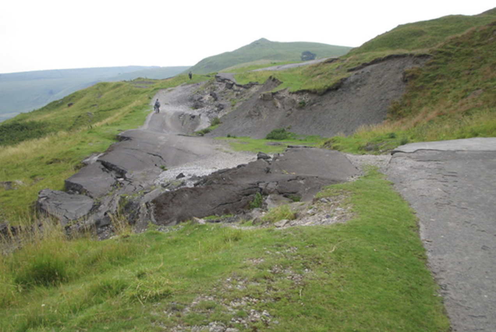

## Northern transport links: what economic difference do they actually make? Theory, reality and alternate realities

Hello, human Dan here. In this project I want to model what economic difference transport links make to, say, the economic relationship between Sheffield and Manchester. Super easy question to ask, but what do we actually know, and can we show some of that openly and intuitively?

Better transport links are an unalloyed good thing, economically, right? It's always at the top of 'northern productivity mystery duh' lists - if transport's lines are pulled into London's gravity well, links between Northern cities suffer and we can't hope to grow our own unique, dense networks.

But they're such a pain to understand. Transport is a syndrome - both cause and effect of economic success. Does a new transport link make economies grow, or does economic growth allow transport to flourish? Add that transport modelling very often assumes fixed location of people, firms and places (Button) when of course geographies shift over years and decades. The humble [container](https://en.wikipedia.org/wiki/The_Box_(Levinson_book)) is my favourite example - over a few decades, that single invention and the infrastructure built on it upended the world's geography, changing which cities shrank and which grew, and turned previously opaque borders into networks where goods moved back and forth along their processing chains multiple times.

So that's all very grand. But what about the [Snake Pass](https://www.derbyshire.gov.uk/council/news-events/news-updates/news/major-investigations-mark-first-steps-towards-identifying-long-term-solution-for-snake-pass-landslip.aspx)? One of only two (and a half?) road routes between Sheffield and Manchester, it is slowly slipping into the ravine. It may quite possibly be destined to end up like the [road below Mam Tor](https://www.bgs.ac.uk/case-studies/mam-tor-derbyshire-landslide-case-study/) - entirely unstoppable 'rotational landslide'.

